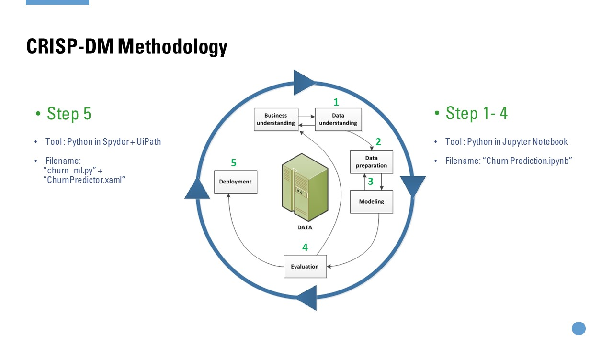
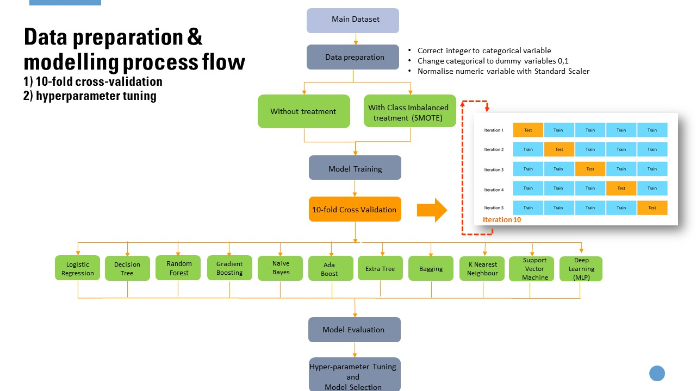
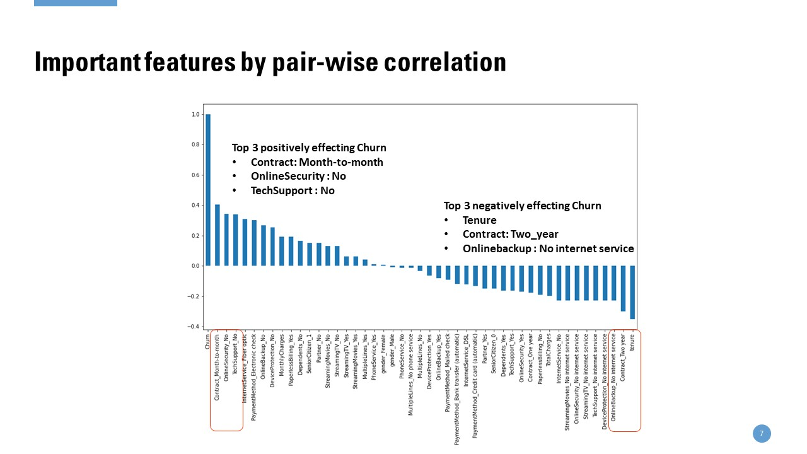
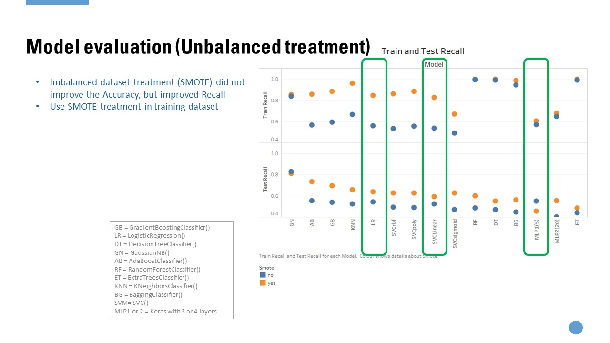

# Business Problem: 
Churn prediction is important to detect customers who are likely to cancel a service subscription based on their profile or product usage behaviour. This is an important prediction to businesses as identify those customers who are at risk of cancelling will enable the personalised marketing action to be taken for each customer to maximise the chances that the customer will remain.  The cost of obtaining a new customer is higher than retaining one. A dataset mimicing  a telecommunication business is obtained from Kaggle (https://www.kaggle.com/blastchar/telco-customer-churn)

# Challenges and Solutions:

Customer churn has an imbalanced dataset problem where the the target variable 'Churn' is imbalanced where 26.5% customers churn with a 'yes' and 73.5% ‘no’, try imbalanced class treatments, eg: undersampling, or oversampling
 

# Technical Setting:  
Technology stack: Python, Spyder on Anaconda, UiPath for Automation  

Classification Algorithms: Multi-Layer Perceptron (MLP), Gradient Boosting, Logistics Regression, Decision Tree, Gausian Naïve Bayes, AdaBoost, Random Forest, Extra Tree, K Nearest Neighbour Classifier, SVM 
Dataset: Customer demographics and servie procurement history

# Business Impact:  
3 factors positively and negatively effecting churn have been identified 

Top 3 algorithms with the highet churn prediction accuracy are Logistics Regression, Support Vector Machine and Multilayer Preceptron. Using SMOTE imbalanced dataset treatment did not improve the Accuracy, but improved Recall. Therefore, SMOTE treatment is used in the feature engineering stage.

# [Code](./Churn Prediction Ver2.ipynb)
Python codes from EDA, ETL, model training and evaluation
[Hyperparameter Tuning of MLP](./Keras Tuner_hyperband.ipynb)

