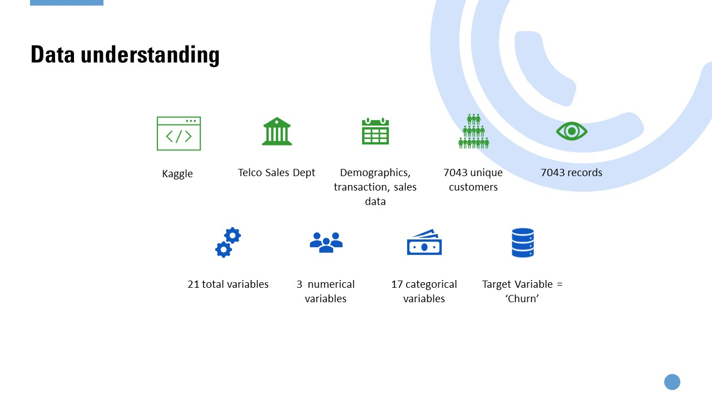

# Business Problem: 
Churn prediction is important to detect customers who are likely to cancel a service subscription based on their profile or product usage behaviour. This is an important prediction to businesses as identify those customers who are at risk of cancelling will enable the personalised marketing action to be taken for each customer to maximise the chances that the customer will remain.  The cost of obtaining a new customer is higher than retaining one. A dataset mimicing  a telecommunication business is obtained from [Kaggle] (https://www.kaggle.com/blastchar/telco-customer-churn).

# Challenges and Solutions:
Consolidation of historical and new data on different formats (word, excel, written) by process re-engineering to collect data in a structured format.  

# Technical Setting:  
Technology stack: Python, MS Power BI, Spyder on Anaconda 
Classification Algorithms: Multi-Layer Perceptron (MLP), Gradient Boosting, Logistics Regression, Decision Tree, Gausian Naïve Bayes, AdaBoost, Random Forest, K Nearest Neighbour Classifier, SVM 
Dataset: job description, candidate demographics, compensation and benefit package

# Business Impact:  
10 key factors were found affecting the offer acceptance decision, mainly contributed by job type and compensation and benefit package. 

Up to 95% predictive accuracy was achieved with MLP.  This assisted the management staff in making job offer decisions, resulting in an acceptance rate of 80% over the last three months.

# [Code](./Churn Prediction.ipynb)
Python codes from EDA, ETL, model training and evaluation 
