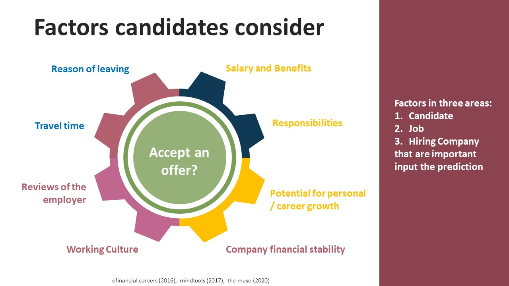

# Business Problem: 
With a normal staff turnover rate of 20%, a high volume of recruitment happens monthly and taking 5 collective man-days of a HR recruiter and hiring manager’s time. However, based on records, 33% of selected candidates reject an offer. A study was conducted to identify the critical factors affecting a candidate’s decision, and to predict the possibility of a candidate accepting a job offer 

# Challenges and Solutions:
Consolidation of historical and new data on different formats (word, excel, written) by process re-engineering to collect data in a structured format.  

# Technical Setting:  
Technology stack: Python, MS Power BI, Spyder on Anaconda 
Classification Algorithms: Multi-Layer Perceptron (MLP), Gradient Boosting, Logistics Regression, Decision Tree, Gausian Naïve Bayes, AdaBoost, Random Forest, K Nearest Neighbour Classifier, SVM 
Dataset: job description, candidate demographics, compensation and benefit package

# Business Impact:  
10 key factors were found affecting the offer acceptance decision, mainly contributed by job type and compensation and benefit package. 

Up to 95% predictive accuracy was achieved with MLP.  This assisted the management staff in making job offer decisions, resulting in an acceptance rate of 80% over the last three months.

# [Code](./hr_dsproject.py)
Python codes from EDA, ETL, model training and evaluation 
